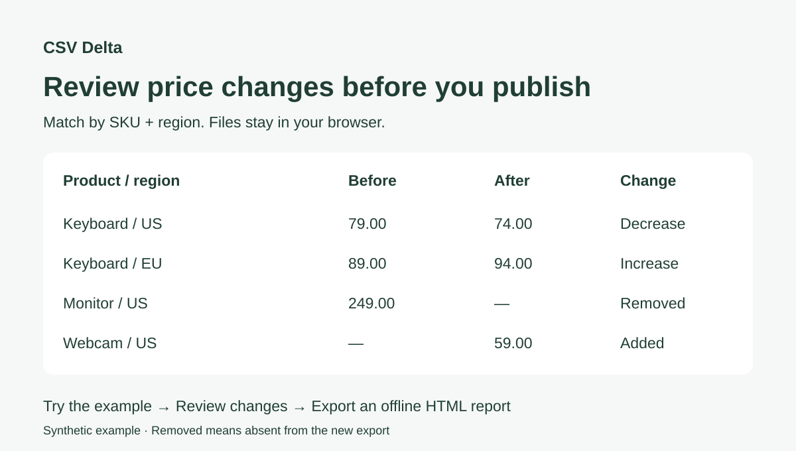

# CSV Delta

**Review price changes before you publish.** Compare CSV exports by SKU and region to find price increases, decreases, added and removed products. Export an offline HTML report. Also works for configuration tables and migration exports.

[Try the browser demo](https://jiaozenghao.github.io/csv-delta/) · [中文说明](README.zh-CN.md) · [Report a problem](https://github.com/JiaoZenghao/csv-delta/issues/new/choose)

No account. No backend. Your files stay in your browser. No runtime dependencies.



## A price-table check in 30 seconds

1. Click **Try the price-table example**, or choose your before and after UTF-8 CSV files.
2. Select the columns that identify a row. Use multiple columns for a composite key.
3. Ignore expected changes such as `updated_at`; opt into numeric comparison for selected columns.
4. Compare, filter the result, and export an offline HTML report.

The included price-table example uses `sku` + `region` as its key, ignores `updated_at`, and compares `price` numerically:

| Added | Removed | Changed | Unchanged |
| ---: | ---: | ---: | ---: |
| 1 | 1 | 2 | 2 |

The same SKU can exist in two regions. Row order and column order do not count as changes. `9.99` and `9.990` match only when numeric comparison is enabled.

[Download before CSV](examples/before.csv) · [Download after CSV](examples/after.csv)

The US keyboard drops from 79 to 74, the EU keyboard rises from 89 to 94, a webcam is added and a monitor is removed. A removed row means it is absent from the new export; it does not establish that a product was delisted.

## What it handles

- Composite keys, with duplicate or empty keys rejected instead of silently overwriting records.
- Exact strings by default, selected ignored columns, and optional absolute numeric tolerance.
- Separate schema changes: added/removed columns are reported outside row-modification counts.
- Comma, tab or semicolon delimiters; quoted fields, embedded newlines, escaped quotes and UTF-8 BOM.
- Type filters and 100-row pagination; English and Chinese interfaces.
- An HTML report containing every result row and comparison settings, usable offline without scripts or remote assets.

## Run locally

Use Node.js 22 or newer. No install step is needed.

```sh
git clone https://github.com/JiaoZenghao/csv-delta.git
cd csv-delta
npm start
```

Open `http://127.0.0.1:4173`. Refreshing clears your loaded data. The app is served as ES modules, so open it through the local server rather than double-clicking `index.html`. Exported reports can be double-clicked directly.

```sh
npm test       # core parser, comparison and report tests
npm run build  # static site in dist/
```

GitHub Actions tests the code and publishes the static site to GitHub Pages.

## Comparison rules and limits

- Inputs: UTF-8, at most **10 MiB and 50,000 data records per file**. Processing happens in memory; very wide files or large reports may take longer.
- Headers must be nonempty and unique. Values and column names preserve whitespace and case. Blank lines are skipped; quoted empty fields are preserved.
- Every selected key column must exist in both files. Whitespace-only key fields are rejected; otherwise key matching is exact, even when other columns use numeric comparison.
- Only common, non-key, non-ignored columns determine modified rows. Added and removed columns appear separately; a schema-only change may have zero modified rows.
- Numeric comparison accepts finite decimal values, including scientific notation. Empty strings, hexadecimal and nonfinite values fall back to exact string comparison. A difference at or below the absolute tolerance is considered equal.
- Numeric arithmetic uses JavaScript floating-point values. This is **not suitable for exact decimal financial accounting**, or integer comparisons beyond JavaScript's safe precision. Keep those columns in string mode.
- No Excel/Parquet import, CLI or automatic key inference in v0.1.0. The initial key suggestion must be reviewed by you.

Files are not uploaded or persisted. Ordinary local builds have no analytics requests or third-party fonts. The hosted demo can enable GoatCounter visit estimates via deployment configuration: it sends a fixed page name and referring website origin, never CSV contents, file names, query strings or comparison results. Do Not Track and Global Privacy Control disable collection. See [analytics setup](docs/analytics.md). GitHub may log requests to the hosted page. Reports include your data, including unchanged rows and ignored columns; choose their recipients carefully.

## How this fits alongside other tools

[csv-diff](https://github.com/simonw/csv-diff) is useful for Python/CLI workflows. [dataloupe](https://github.com/aurelio-nakamura/dataloupe) offers broader data exploration and offline reports. CSV Delta focuses on an immediate browser workflow with explicit keys, duplicate-key rejection and opt-in numeric tolerance. It does not claim to replace every CSV diff tool.

## Feedback and contributions

Tell us what export you were comparing and where the result was confusing. Use synthetic or redacted data in public issues. See [CONTRIBUTING.md](CONTRIBUTING.md) for the development workflow.

If this saves you a manual spreadsheet check, a star helps others discover it.

## License

[MIT](LICENSE).
