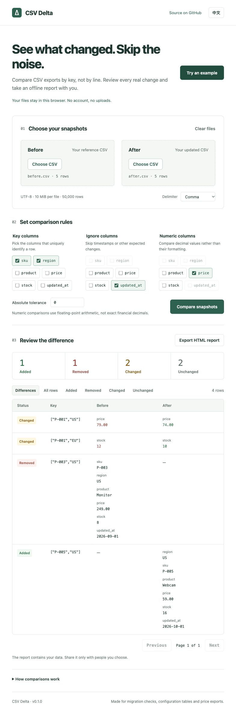

# CSV Delta

**按主键比较 CSV，直接查看真实变化。** 找出新增、删除和修改的记录，导出可直接打开的离线 HTML 报告。

[在线体验](https://jiaozenghao.github.io/csv-delta/) · [English](README.md) · [反馈问题](https://github.com/JiaoZenghao/csv-delta/issues/new/choose)

无需账号、无需后端。文件仅在当前浏览器处理，不上传、不自动保存。没有运行时第三方依赖。



## 使用方法

1. 点击“体验示例”，或选择旧、新两份 UTF-8 CSV 文件。
2. 选择主键列，可用多个列组成复合主键。
3. 忽略 `updated_at` 等预期变化；按需选择数值列与绝对容差。
4. 比较、筛选结果，导出完整 HTML 报告。

内置价格表示例以 `sku` + `region` 为主键，忽略更新时间，按数值比较价格。预期结果为：1 行新增、1 行删除、2 行修改、2 行未变。行列重排不会产生差异，`9.99` 和 `9.990` 只有在开启数值比较后才相等。

## 功能

- 复合主键；重复或空主键直接报错，不覆盖数据。
- 默认精确字符串比较；可选择忽略列和数值列，设置非负绝对容差。
- 新增、删除列单独展示，不计入行修改数量。
- 支持逗号、制表符、分号，以及带引号的字段、字段内换行、转义双引号和 UTF-8 BOM。
- 按变化类型筛选，每页 100 行，中英文切换。
- 离线报告包含全部结果和设置，无脚本或远程资源。

## 本地运行

需要 Node.js 22 或更高版本，无需安装依赖。

```sh
git clone https://github.com/JiaoZenghao/csv-delta.git
cd csv-delta
npm start
```

打开 `http://127.0.0.1:4173`。网页使用 ES modules，需要通过本地服务器打开；导出的 HTML 报告可以直接双击。

```sh
npm test
npm run build
```

## 比较规则与限制

- 每份文件最多 **10 MiB、50,000 条数据记录**，仅支持 UTF-8。全部在内存中处理，宽表和大报告可能较慢。
- 表头不能为空或重复；列名、字段值的空白、大小写均保留。空白行跳过，带引号的空字段保留。
- 主键列须在两份文件中存在；纯空白主键拒绝。主键始终精确匹配。
- 只用共同的非主键、非忽略列判断行修改。只有列结构变化时，行修改数可能为零。
- 数值列支持有限十进制和科学计数法；非数字、空字符串、十六进制和无穷值回退为字符串比较。
- 数值运算采用 JavaScript 浮点数，不适用于精确十进制财务核算或超出安全精度的大整数；这些列请保持字符串比较。
- 首版不支持 Excel、Parquet、命令行或自动推断主键。请核对默认主键建议。

文件不上传、不持久化，刷新后清空。GitHub 托管服务可能记录页面访问。导出报告包含原始值，包括未变行和忽略列，请自行选择分享对象。

## 反馈

欢迎说明具体核对场景和遇到的问题。公开 issue 请使用模拟或脱敏数据。[贡献指南](CONTRIBUTING.md)。如果工具节省了你的核对时间，可以给项目一个 star，帮助其他人发现它。

## 许可证

[MIT](LICENSE)。

本地构建默认不发送访问统计请求，也不加载第三方字体。线上演示可通过部署配置启用 GoatCounter 访问估算，只发送固定页面名称和来源网站域名，不发送 CSV 内容、文件名、查询参数或比较结果；尊重“不跟踪”和 Global Privacy Control。详见 [统计配置](docs/analytics.md)。
